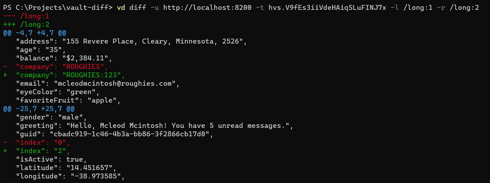

# vault-diff

A simple CLI utility to observe changes in non-sealed Vault secrets, like KV.

[](https://github.com/mih-kopylov/vault-diff/releases/latest)
[](https://github.com/mih-kopylov/vault-diff/blob/master/LICENSE)
[](https://github.com/mih-kopylov/vault-diff/actions/workflows/build.yml)
[](http://godoc.org/github.com/mih-kopylov/vault-diff)
[](https://goreportcard.com/report/github.com/mih-kopylov/vault-diff)

## Installation

Run

```shell
go install github.com/mih-kopylov/vault-diff/app/vd@latest
```

Or just download a binary from [the latest](https://github.com/mih-kopylov/vault-diff/releases/latest) release

## UI Mode Usage

The following command will start UI mode that allows selecting desired vault secrets and show their difference.

```shell
vd ui --url http://localhost:8200 --token hvs.replace-token
```

Once run press `h` button to show help

https://user-images.githubusercontent.com/6898003/211198459-2cda383a-bcb0-44d4-9790-a02a229c2c1c.mp4


## Diff Mode Usage

The following command will show difference between 15 and 16 versions of `/my/secret` KV secret.

```shell
vd diff --url http://localhost:8200 --token hvs.replace-token --left /my/secret:15 --right /my/secret:16 
```

It can also compare different secrets of any versions.

```shell
vd diff --url http://localhost:8200 --token hvs.replace-token --left /my/secret:15 --right /my/another/secret:33 
```


